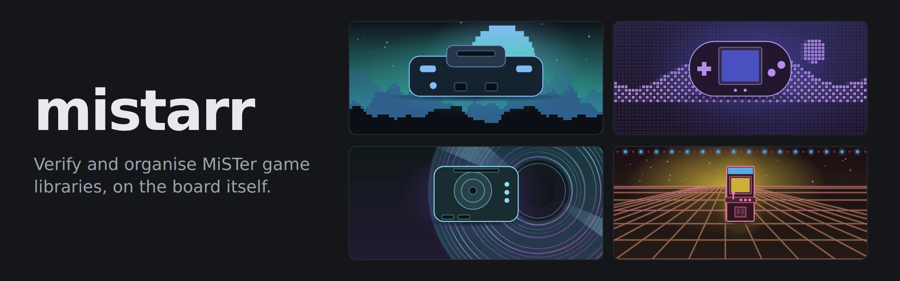
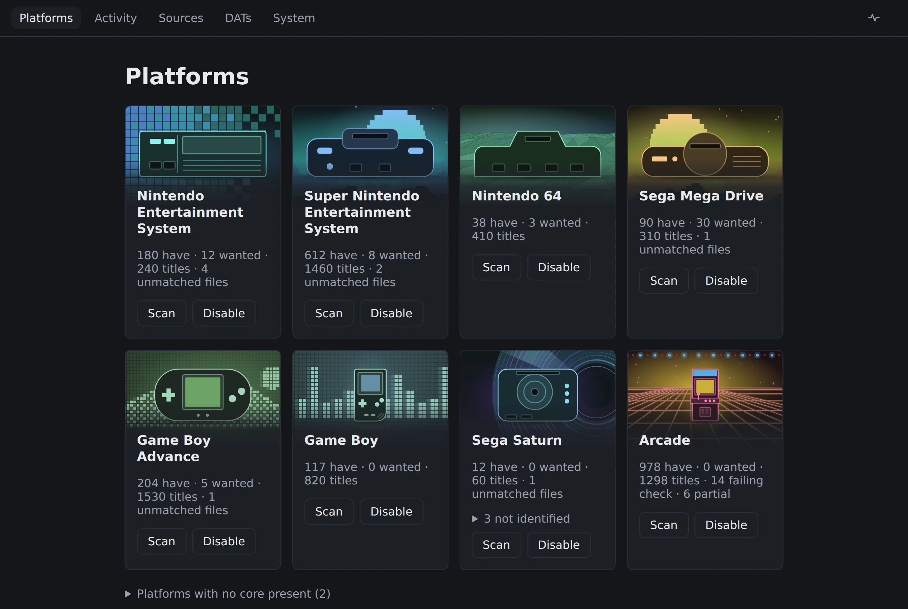
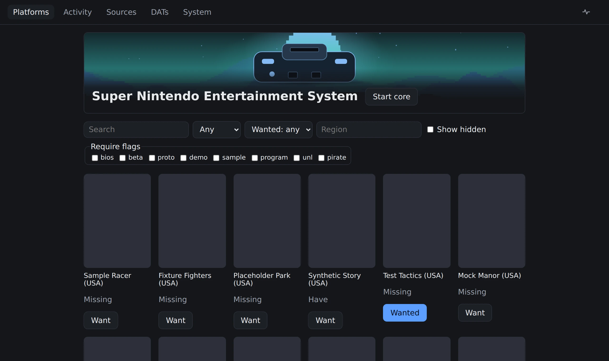
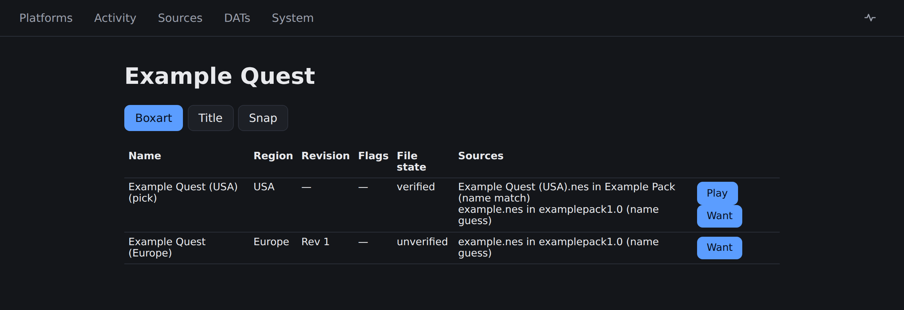
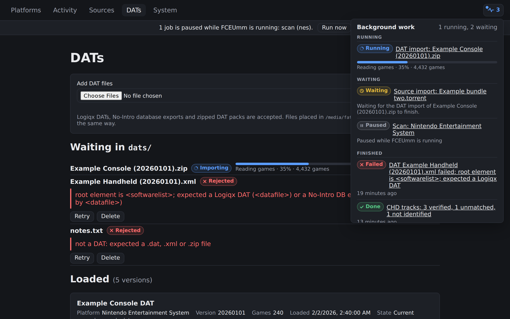
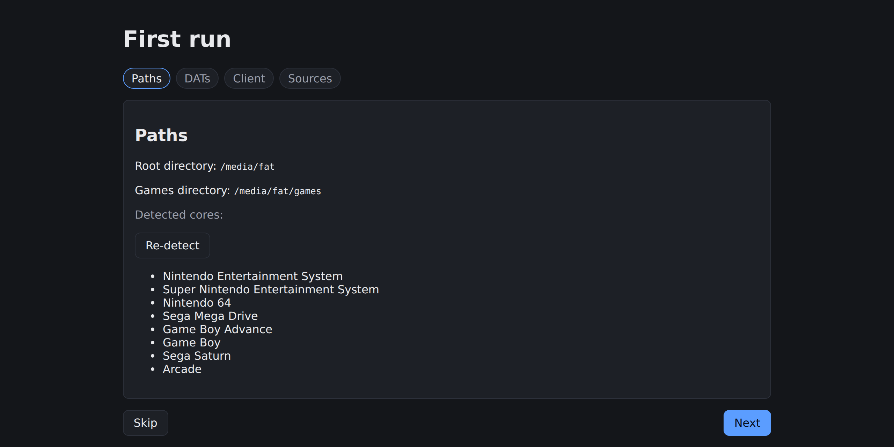
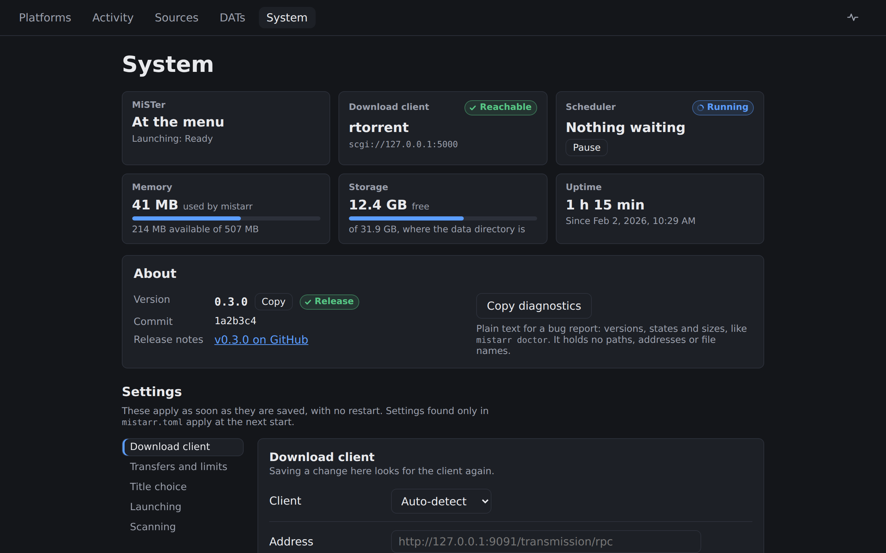
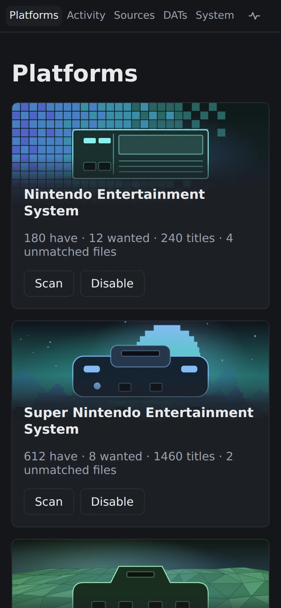

<picture>
  <source media="(prefers-color-scheme: dark)" srcset="docs/images/hero-dark.webp">
  <source media="(prefers-color-scheme: light)" srcset="docs/images/hero-light.webp">
  
</picture>

# mistarr

**A verifier and organiser for [MiSTer FPGA](https://github.com/MiSTer-devel/Wiki_MiSTer/wiki)
game libraries that runs on the DE10-Nano itself.** It checks the files you
already have against the DAT files you give it, puts each one where its core
expects it, and adds a small front end for the torrent client that ships with
the MiSTer Linux image.

It is one static ARMv7 binary with the web UI embedded, written in Rust, and
runs on the stock MiSTer image and on
[Buildroot_MiSTer](https://github.com/mcfbytes/Buildroot_MiSTer). Open it from
a desktop browser or a phone on the couch.

## What it does

**Catalogue every platform you have a core for.** Load No-Intro DATs (daily
packs or the database export), Redump or any Logiqx-format DAT. mistarr binds
each one to its platform and shows what you have, what is missing and what
needs a look, one card per core.

<picture>
  <source media="(prefers-color-scheme: dark)" srcset="docs/images/platforms-dark.webp">
  <source media="(prefers-color-scheme: light)" srcset="docs/images/platforms-light.webp">
  
</picture>

**Scan and verify what is already on the card.** It hashes the files in
`games/`, matches them against the DATs, and marks each entry verified,
unverified, misnamed or missing. Browse groups titles one-game-one-ROM with
your region and revision preferences; a title lists every variant with its
file state and the sources that list it. CHD disc images can be identified
by their tracks, an optional and slower check.

<picture>
  <source media="(prefers-color-scheme: dark)" srcset="docs/images/browse-dark.webp">
  <source media="(prefers-color-scheme: light)" srcset="docs/images/browse-light.webp">
  
</picture>

<picture>
  <source media="(prefers-color-scheme: dark)" srcset="docs/images/title-dark.webp">
  <source media="(prefers-color-scheme: light)" srcset="docs/images/title-light.webp">
  
</picture>

**Place files the way each core expects them, without getting in the way.**
Verified files are renamed and moved into the right `games/<Core>` directory
in the right form: iNES headers, big-endian N64, multi-track discs kept
together, Neo Geo romset layout, arcade zips beside their MRA. While a core
is running, hashing, scans and placement pause, transfers slow to the rate
limits you set for that case, and mistarr's I/O drops to the idle class.
Memory is budgeted for a board with under half a gigabyte to share with
MiSTer. The activity panel shows what is running, what waits and why.

<picture>
  <source media="(prefers-color-scheme: dark)" srcset="docs/images/activity-dark.webp">
  <source media="(prefers-color-scheme: light)" srcset="docs/images/activity-light.webp">
  
</picture>

**Transfers from sources you add.** Drop `.torrent` or `.magnet` files into a
watched directory. mistarr binds each source to a platform by matching its
file list against your DATs; when you mark an entry as wanted it asks
Transmission or rtorrent for just that file, verifies it and files it. Seeding
is a setting on each source.

<p>
  <picture>
    <source media="(prefers-color-scheme: dark)" srcset="docs/images/wizard-dark.webp">
    <source media="(prefers-color-scheme: light)" srcset="docs/images/wizard-light.webp">
    
  </picture>
  <picture>
    <source media="(prefers-color-scheme: dark)" srcset="docs/images/system-dark.webp">
    <source media="(prefers-color-scheme: light)" srcset="docs/images/system-light.webp">
    
  </picture>
</p>

<p align="center">
  <picture>
    <source media="(prefers-color-scheme: dark)" srcset="docs/images/phone-dark.webp">
    <source media="(prefers-color-scheme: light)" srcset="docs/images/phone-light.webp">
    
  </picture>
</p>

The screenshots use the web UI's mock data, which is synthetic, with cover art
turned off, so every poster is the one mistarr draws for a title without a
cover; `docs/TESTING.md` says how to regenerate them. In use, covers load in
your browser from the libretro thumbnail server, and nothing but the database
is stored on the SD card.

## What it deliberately does not do

mistarr contains no sources. It ships with no torrents, magnets, tracker
addresses, site definitions, DAT files or BIOS images, and it never suggests
any. Everything it transfers comes from files you placed in its watched
directories. The catalogue, scan, verify and place features work with no
source at all. See [docs/PRINCIPLES.md](docs/PRINCIPLES.md) for the design
rules that keep it that way and why they are not negotiable.

## Install

On the board, over SSH:

```sh
curl -fsSL https://github.com/mcfbytes/mistarr/releases/latest/download/install.sh | sh
```

`/bin/sh` on the stock MiSTer image is BusyBox and runs this as written; a
`bash` present on the board works too. From the MiSTer Scripts menu, copy
`install.sh` from a release to `/media/fat/Scripts/mistarr_install.sh` and run
it from there instead. Once it runs,
`Scripts/mistarr.sh` prints the address to open.

To upgrade, run the same command again: the database and config are kept, and
the previous version is saved first. If the new version fails to start, the
installer puts the previous version back. See
[docs/DEPLOYMENT.md](docs/DEPLOYMENT.md) for installing a given version,
manual rollback and how releases are built.

## Status

In active development. Releases are published on the
[releases page](https://github.com/mcfbytes/mistarr/releases); the
architecture and the work still open are in
[docs/ARCHITECTURE.md](docs/ARCHITECTURE.md) and
[docs/WORKPLAN.md](docs/WORKPLAN.md).

## Documentation

| Document | Contents |
|---|---|
| [docs/ARCHITECTURE.md](docs/ARCHITECTURE.md) | Components, crate layout, runtime flows, resource budgets |
| [docs/PRINCIPLES.md](docs/PRINCIPLES.md) | Content-neutrality rules every contributor and agent must follow |
| [docs/DATA-MODEL.md](docs/DATA-MODEL.md) | SQLite schema and state machines |
| [docs/API.md](docs/API.md) | HTTP API and event stream |
| [docs/PLATFORMS.md](docs/PLATFORMS.md) | DAT to core directory table and per-core adapters |
| [docs/VERIFICATION.md](docs/VERIFICATION.md) | DAT parsing, hashing, matching, 1G1R selection |
| [docs/DOWNLOAD-CLIENTS.md](docs/DOWNLOAD-CLIENTS.md) | Transmission and rtorrent integration |
| [docs/UI.md](docs/UI.md) | Screens, states and the SPA build |
| [docs/DEPLOYMENT.md](docs/DEPLOYMENT.md) | Cross-compiling, installing on MiSTer, startup |
| [docs/DATS.md](docs/DATS.md) | DAT formats, loading, platform binding, versions and rejection reasons |
| [docs/TESTING.md](docs/TESTING.md) | Fixtures, open-licensed test content, end-to-end runs |
| [docs/WORKPLAN.md](docs/WORKPLAN.md) | Work packages for parallel development |
| [CLAUDE.md](CLAUDE.md) | Instructions for coding agents working in this repository |

## Licence

MIT. See [LICENSE](LICENSE). This software is provided as is, without warranty
of any kind. It is a file organiser and torrent-client front end; what you load
into it is your responsibility.
