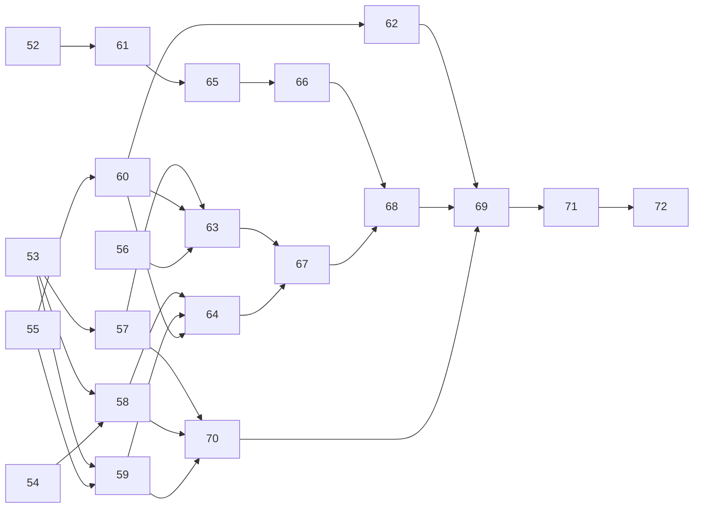

# Consolidation

The consolidation waves in WORKPLAN.md (waves 4 to 11) make each problem in the
workspace solved one way, remove duplicated code, and fix the defects the
architecture review found. This file holds each package's task list. The
orchestrator ticks a task when the pull request that does it merges, and ticks
the package in the progress list when every task in it is ticked.

Rules for these packages, on top of the ones in WORKPLAN.md:

- Behaviour stays the same unless a task says otherwise. A moved function keeps
  its tests; a deleted duplicate's tests move to the survivor.
- A package that changes a public signature updates every caller, in whichever
  crate it sits, and changes nothing else there.
- Moved items leave no re-export or shim behind.
- The pull request body states the net line count and, for server and mister
  changes, confirms `cargo zigbuild` for armv7 still passes and the binary did
  not grow.
- Packages in one wave run in parallel. Where two of them touch the same files
  the wave note gives a merge order; a later package merges `master` before
  its pull request is reviewed.

## Progress

- [ ] **Wave 4**: no dependencies
  - [ ] WP-52 Web lists and load errors · Sonnet
  - [ ] WP-53 Core codecs · Opus
  - [ ] WP-54 Parser limits in mister · Sonnet
  - [ ] WP-55 Server errors and blocking · Opus
  - [ ] WP-56 Config load and validation · Sonnet
- [ ] **Wave 5**: merge order 57, 58, 59, 60
  - [ ] WP-57 Clients on core codecs · Opus · after 53
  - [ ] WP-58 Mister on core · Opus · after 53, 54
  - [ ] WP-59 One intake for dropped files · Sonnet · after 53, 55
  - [ ] WP-60 Database types · Opus · after 55
  - [ ] WP-61 Web mock at the API boundary · Opus · after 52
- [ ] **Wave 6**: merge order 62, 63, 64
  - [ ] WP-62 Database layout and fixtures · Sonnet · after 60
  - [ ] WP-63 HTTP shell · Opus · after 56, 57, 60
  - [ ] WP-64 Matching and scan · Opus · after 58, 59, 60
  - [ ] WP-65 Web stores · Sonnet · after 61
- [ ] **Wave 7**
  - [ ] WP-66 Web components and styles · Sonnet · after 65
  - [ ] WP-67 Job framework · Opus · after 63, 64
- [ ] **Wave 8**
  - [ ] WP-68 Typed events and progress · Sonnet · after 66, 67
  - [ ] WP-70 Workspace lints and dependencies · Haiku · after 57, 58, 59
- [ ] **Wave 9**
  - [ ] WP-69 Digests, names and ids across crates · Opus · after 62, 68, 70
- [ ] **Wave 10**
  - [ ] WP-71 Server surface and test helpers · Sonnet · after 69
- [ ] **Wave 11**
  - [ ] WP-72 Docs sweep · Haiku · after 71

## Wave 4

### WP-52 Web lists and load errors

Sonnet · `web/` · branch `wp-52-web-lists`

- [x] The platforms, sources, downloads, imports, jobs, recent-jobs and both
  incoming stores read every page, as `dats.svelte.ts` does, so no list stops
  at the API's default limit of 100.
- [x] A failed title load shows a not-found or error state with Retry, following
  SourceDetail's `missing`/`loadError` pattern; the page never stays on
  "Loading…".
- [x] A failed settings load on System shows an error with Retry instead of
  hiding the Settings section.
- [x] No bare `void loadX()` remains in routes, `App.svelte` or `events.ts`:
  each failure is recorded and shown, or caught with a stated reason.
- [x] Deleting a source asks for confirmation inline, as Dats does.
- [x] Playwright: a mock with 150 sources lists all 150; a missing title shows
  the error state; a failed settings load shows Retry.

### WP-53 Core codecs

Opus · `mistarr-core`, `mistarr-sources`, import lines elsewhere · branch
`wp-53-core-codecs`

- [x] `mistarr_core::hex` with `encode`, `decode` and `decode_spaced`; core and
  sources use it (`hash.rs` `hex`, `chd/header.rs`, `magnet.rs`
  `decode_hex_20`).
- [x] `Digest<const N: usize>` with `Display`, `FromStr` and serde as lowercase
  hex; aliases `Crc32`, `Md5`, `Sha1`; `InfoHash` over `Digest<20>`.
  `Sha1Digest` in `chd/header.rs` becomes `Sha1`.
- [x] `sources::bencode` moves to `core::bencode` (`Raw`, `Value`, `encode`).
  The owned decoder (`decode`, `decode_value`, `decode_list`, `decode_dict`,
  `decode_bytes`) goes; `decode_int` returns `i64`; fixture tests read with
  `Raw`.
- [x] `core::magnet` with one `parse_magnet`: `urn:btih:` matched without
  regard to case, values percent-decoded, hex and base32 hashes; one
  `percent_decode` in core; proptests for both.
- [x] `TorrentMeta.infohash` and `Magnet.infohash` are `InfoHash`.
- [x] Sources' `normalise_name` is `normalize_for_match(strip_extension(n))`;
  `is_disallowed` and `collapse_whitespace` go; `unicode-normalization` leaves
  sources; one spelling, `normalize`, in both crates.
- [x] `HeaderRule` gains `as_str`, a `FromStr` that refuses unknown names, and
  serde; `from_name` goes. Header constants (iNES magic and length, copier
  header length), `HeaderRule::smc_applies(size)` and N64 byte-order
  detection are public.
- [x] `DatRom::header_bytes()` returns the DAT header as bytes.
- [x] `core::xml` gains `resolve_ref`, `attr_value` and
  `CappedReader::new(reader, event_cap, depth_cap)` built from `Capped` and
  `EscapeInvalid`; the DAT parser uses them.
- [x] `read_probe` and `discard` in `hash.rs` use `Read::take` with
  `read_to_end` and `io::copy` to `io::sink`.
- [x] ARCHITECTURE.md's crate table says core owns these codecs.

### WP-54 Parser limits in mister

Sonnet · `mistarr-mister` · branch `wp-54-mister-limits`

- [x] The MRA reader caps element depth at 64 and event size as the DAT parser
  does, and its open-element stack stores no per-tag allocation beyond those
  caps. A 16 MiB document nested a million deep is refused with an error.
- [x] The NeoGeo romsets reader streams through a `BufReader` with size, event
  and depth caps instead of `fs::read`.
- [x] `Error::Mra` and `Error::Romsets` carry the XML error and byte position
  as typed fields, not a `String`.
- [x] Proptests: `parse_romsets` and the MRA reader never panic.
- [x] The pull request states the peak memory of the worst capped input.
- [x] The MRA and NeoGeo readers cap accumulated output, not only event size
  and depth: roms, items per rom and zip names for MRA, romsets and BIOS
  names for NeoGeo, each refused past its cap and deduplicated with a
  `HashSet` rather than a linear scan.

### WP-55 Server errors and blocking

Opus · `mistarr-server` · branch `wp-55-server-blocking`

- [ ] `threads::run(label, f)` is async and returns `Result<R>`;
  `Error::Task` carries the `JoinError` through `#[from]`. Every
  `.map_err(|e| Error::Task(e.to_string()))` goes, as do the local blocking
  wrappers in `jobs/arcade.rs`, `jobs/core_limits.rs`, `http/launch.rs` and
  `jobs/import.rs` (`task`).
- [ ] `Error` gains `Json(#[from] serde_json::Error)` and
  `Client(#[from] ClientError)`; no variant wraps a typed error's
  `to_string()`; `Error::UnknownJob` goes if nothing builds it.
- [ ] Blocking filesystem calls leave the async workers: the DAT watcher's
  poll, the DAT import's `is_file`, `list_members`, `create_dir_all`,
  `rename` and `reject`, `import_in_ram`'s `members_size`, and the remaining
  `exists` and `is_dir` calls in `import.rs`, `scan.rs` and `arcade.rs`.
  `scan::file_meta` folds into the blocking listing, which returns size and
  mtime.
- [ ] One write gate: `write_blocking`, `write_bulk_blocking` and
  `hold_writer_blocking` take the `write_turn` permit. A test shows an async
  writer queued behind a blocking bulk write holds no blocking thread.
- [ ] `Db::write_tx` and `write_tx_blocking` open a transaction and end with
  `db::commit`; the roughly 40 hand-written `transaction()` then `commit`
  sites use them. Database functions never open transactions, except
  batching functions named as such (`delete_missing`, `platforms::seed`).
- [ ] `AppState` holds `RwLock<Arc<Config>>` and `config()` returns
  `Arc<Config>`; `status::snapshot` clones no `Config`.
- [ ] `status::publish(app)` replaces the six copies of snapshot-then-publish.

### WP-56 Config load and validation

Sonnet · `mistarr-server` (`config.rs`, `app.rs`, `http/system.rs`) · branch
`wp-56-config-validate`

- [x] A TOML error reads `config: <path>: <error>`, with the prefix once.
- [x] An unknown key in `mistarr.toml` is logged as a warning naming the key;
  startup continues. A new dependency for this needs the usual justification.
- [x] `Config::validate()` is the single source of config problems. `open_db`
  logs each at startup, the import floor before the settings overlay and
  the path map after; `PUT /system/settings` runs it to check a patch's `client`.
- [x] Tests for each of the three.

## Wave 5

Merge order: 57, 58, 59, then 60, which touches the most server files.

### WP-57 Clients on core codecs

Opus · `mistarr-clients`, server callers · branch `wp-57-clients-core`

- [ ] `metainfo.rs` and the clients' `sha1` dependency go.
  `TorrentSource::Metainfo { bytes, infohash, file_count }` and
  `TorrentSource::Magnet { uri, infohash }` are built by the server from the
  sources parse.
- [ ] rtorrent's `magnet_hash`, `percent_decode` and `base32_hash` go;
  `fetch/url.rs` uses core's `percent_decode`.
- [ ] `InfoHash` comes from core; `ClientTorrentId` wraps it, so rtorrent's
  `parse_id` and Transmission's lowercasing go.
- [ ] `Wanted(BTreeSet<u32>)` with `from_slice` and `check(file_count)`
  replaces both `check_indices` and the per-call sets.
- [ ] `ClientError::protocol(impl Display)` replaces both `protocol()` helpers;
  one `http::handshake(io)` returns the sender and one `AbortOnDrop`.
- [ ] Transmission's `simple` goes through the same helper as `torrent_set`.
- [ ] `RemotePathMap::to_remote`; each client maps `download_dir` inside `add`,
  so the trait takes local paths. `mistarr_clients::connect(kind, url, map)`
  replaces the server's `ClientKey::build` and `client.rs` `to_remote`.
- [ ] The XML-RPC server-side encoders sit behind `test-support`; `xmlrpc` is
  `pub(crate)`.
- [ ] Proptests: the XML-RPC parser and `scgi::body_range` never panic.

### WP-58 Mister on core

Opus · `mistarr-mister`, server callers · branch `wp-58-mister-core`

- [x] `Platform.header_rule` is a `HeaderRule`. `adapter::build` matches on
  kind and rule, not on id strings. The server's copies of `header_rule` in
  `jobs/scan.rs` and `jobs/import/support.rs` go.
- [x] Adapters use core's header constants and byte-order detection;
  `cart.rs` and `ByteOrder` duplicates go.
- [x] `CoreAdapter` keeps `plan_placement` only; the platform, directory,
  BIOS and accepts facts are read from the `Platform` row, and
  `row_methods!` goes. The scan keeps its own extension rules, since
  `Nes::accepts` requires the iNES magic that headerless files lack.
  ARCHITECTURE.md's adapter section says so.
- [x] `PlacementPlan::rename(from, to)`, `exact_name(&str)` and one
  `has_extension` replace the repeated constructions.
- [x] `Kind` gains `as_str` and `FromStr`; the server's `kind_str` goes.
- [x] Mister's `DatRom` becomes `PlaceRom` and takes header bytes from
  core's `dat::decode_header`, the rule behind `DatRom::header_bytes()`.
  `mra.rs` keeps its own streaming hex decoder, since MRA hex (a lone final
  digit, `,` separators) is a grammar core's `hex` does not cover.
- [x] MRA and romsets readers use `core::xml` `CappedReader`, `attr_value` and
  `resolve_ref`.
- [x] `RecordingSink` and `FakeOutcome` sit behind `test-support`.
- [x] Tests use `tempfile::TempDir`; none leaves a directory in the system temp
  directory.

### WP-59 One intake for dropped files

Sonnet · `mistarr-sources`, server `jobs/dat_import.rs`,
`jobs/source_import.rs` · branch `wp-59-intake`

- [ ] `mistarr_sources::intake::StableFiles` reports a file once it is older
  than the minimum age and its size held across two polls, once per size and
  mtime, and forgets files that are gone. It takes a name filter. `Scanner`
  and `DatWatcher` go.
- [ ] `intake::accept` and `intake::reject` pick a free name with `create_new`
  and a bounded number of attempts, write the reason as `reason\n`, and run on
  a blocking thread. `dat_import::reject`, `unique_path` and
  `watch::mark_loaded`, `mark_rejected` and `move_into` go.
- [ ] Tests: a stable file is reported once; a moved file is forgotten; a name
  already in `loaded/` gets a new name.

### WP-60 Database types

Opus · `mistarr-server` · branch `wp-60-db-types`

- [ ] `db/ids.rs` has an `id!` macro emitting the struct, one derive set,
  `Display`, `ToSql`, `FromSql` and transparent serde, for `FileId`,
  `TitleId`, `SourceId`, `JobId`, `DownloadId`, `DatVersionId` and a new
  `RomId`. No database function or row carries a bare `i64` id.
- [ ] A `text_enum!` macro emits `as_str`, `ALL`, `ToSql` and a `FromSql` that
  fails on unknown text, for `FileState`, `JobState`, `SourceState`,
  `DownloadState`, `Lane`, title source, rom status and confidence. The four
  different fallbacks for unknown text go.
- [ ] Sets of states are named once: `DownloadState::OPEN` and `SELECTED`,
  `JobState::ACTIVE` and `FINISHED`, each with an SQL fragment a unit test
  checks against the array. The second constant named `OPEN`, in
  `source_detail.rs`, and about 20 literal lists go; `RECENT_KINDS` is bound,
  not interpolated.
- [ ] `JobRow.kind` and `lane` are typed; `status::hold_reason` takes a `Lane`.
- [ ] `db/sql.rs` holds `to_u64`, `to_i64` and `get_u64`; the six local
  conversion helpers go.
- [ ] Lists are bound one way, with `json_each`; `groups::placeholders` goes.
- [ ] Every JSON failure maps to `Error::Stored`; nothing substitutes `"[]"`.
- [ ] `Page { limit, offset }` and `Paged<T> { items, total }`; the count and
  the page run in one read transaction; `files::unidentified` takes its
  arguments in the same order as every other pager.
- [ ] The file upsert uses `RETURNING id`.
- [ ] `has_table` takes a schema and is used everywhere; every read-only open
  goes through `open_read_only`; one `BUSY_TIMEOUT` constant.
- [ ] The arcade recompute flag goes through `settings::keys` and
  `settings::set`.
- [ ] `sources.reason` and the DAT replaced and older reasons are stored as
  codes with parameters and worded in `http/`; migration 0021 rewrites stored
  prose to codes.
- [ ] `db/plans.rs` passes unchanged in intent.

### WP-61 Web mock at the API boundary

Opus · `web/` · branch `wp-61-web-mock`

- [ ] `src/mock/` implements the `api` object's type and an in-memory event
  stream that feeds `events.ts` `handle()`; `main.ts` installs it when
  `VITE_MOCK=1`.
- [ ] No `isMock` or `VITE_MOCK` outside `src/mock/` and `main.ts`, enforced by
  a lint rule or a check in `npm run lint`.
- [ ] The fetch and progress simulation leaves `jobs.svelte.ts`; the mock
  binding leaves `SourceDetail.svelte`.
- [ ] One `mockKnob<T>(key, fallback)` replaces the localStorage readers in
  `fixtures.ts`; `window.mistarrReloadTitles` goes.
- [ ] `e2e/helpers.ts` holds `openPanel`, `noCovers` and `setMockKnob`;
  `waitForTimeout` calls become locator waits.
- [ ] The production bundle contains no fixture strings and stays inside its
  size budget.

## Wave 6

Merge order: 62, 63, 64.

### WP-62 Database layout and fixtures

Sonnet · `mistarr-server` (`db/`, tests) · branch `wp-62-db-layout`

- [ ] `files.rs` splits into `files.rs` (the `files` table), `roms.rs` and
  `scan_progress.rs`. `roms.rs` has one `match_tiers` behind `match_rom`,
  `match_live_rom` and `roms_matching`, and the rom lookups from `files.rs`,
  `imports.rs`, `downloads_import.rs` and `arcade.rs`.
- [ ] `NewFile` is the one input for a file row; `Hashed`, `Columns` and the
  many-argument `upsert` go.
- [ ] `titles.rs` becomes `titles/` with `mod.rs`, `recompute.rs`, `browse.rs`
  and `detail.rs`.
- [ ] One `put_title` serves the DAT and MRA `upsert_title`.
- [ ] `platforms::find(&PlatformId)` with `COLUMNS` and `from_row`;
  `platforms::get` and `sources::platform_exists` go; `titles` and `arcade`
  take `&PlatformId`.
- [ ] `db::fixtures`, gated by `test` or `test-support`, has `conn()`,
  `catalog()` and a builder `dat(pid).title(name).rom(name, hashes, status)`
  returning typed ids. The `seed_*_fixture` families and the 16 `conn()`
  copies go; no fixture ships in a release build.
- [ ] The temp-directory code leaves `db/mod.rs` for `tempdir.rs`;
  `install_file`, `sync_parent` and `remove_if_present` move to
  `db/ram/swap.rs`; `ram.rs` uses the memory and free-space readers in
  `status.rs`.
- [ ] `settle_elsewhere` and `want_again` move to `downloads.rs`. DATA-MODEL.md
  states the rule: table modules own writes, and read-only composite views
  sit in `db/views/`.
- [ ] Migration tests use `apply_through(conn, n)` and seed old schemas with
  SQL written for that version.
- [ ] The statement rule is written in DATA-MODEL.md and applied:
  `prepare_cached` for statements run per row, `prepare` for one-shot reads.

### WP-63 HTTP shell

Opus · `mistarr-server` (`http/`, `app.rs`, `config.rs`, `incoming.rs`,
`status.rs`, `client.rs`, `main.rs`), `web/` for the 202 change · branch
`wp-63-http-shell`

- [ ] `incoming/place.rs` holds `SourceFile`, `place_source`, `place`,
  `file_name`, `part_path` and `place_part`, returning
  `PlaceError { Duplicate, NoFreeName, Io }`. Jobs import from it, never from
  `http`; `after_cancel` moves to `jobs/transfer.rs`; the `http` re-exports go.
- [ ] One `place_unique(dir, name, write)` with `create_new` and a cap, one
  `part_path` and a `PART_PREFIX` constant.
- [ ] Source uploads stream through axum `Multipart` as DAT uploads do; the
  hand-written `multipart_file` and `find` go.
- [ ] `ApiPath`, `ApiQuery` and `ApiJson` extractors reject with `ApiError`;
  `OptionalJson<T: Default>` has one empty-body rule. The per-module id
  helpers go and ids are extracted as newtypes.
- [ ] `ApiError` has a `#[non_exhaustive]` `Code` enum whose `status` and
  `as_str` match API.md; `ApiError::new` is private; constructors include
  `no_such(what)`. `From<Error>` maps actionable variants, such as `NoRoom`
  to 503. The 502 answered with code `internal` goes.
- [ ] API error messages follow one style under PRINCIPLES.md section 5.
- [ ] Settings: `RuntimeSettings` with every field optional is also the patch
  type, so `SettingsPatch` and `overlay` go. `PrefsConfig` flattens core's
  `Prefs`, with `HiddenFlag::from_name` in core. `update_settings` owns the
  side effects and returns what changed; the handler is a few lines.
- [ ] `AppState` groups client state in a `ClientSlot` in `client.rs` and
  launch state in a `LaunchSlot`, with one visibility rule for fields.
- [ ] `open_db` splits into `clean_leftovers` and opening, returning a
  `Startup` struct instead of tuples; `Options::for_board(ram_dir)` is used by
  `main`.
- [ ] `platforms::list` uses `Page::slice`; query structs share one `paging()`;
  bodies deny unknown fields and queries allow them.
- [ ] API.md states that an answer whose purpose is a queued job is 202;
  `POST /system/scan` and `/system/cores` follow it, and the web client too.
- [ ] `http/stubs.rs` and its API.md sentence go.
- [ ] `synth` and `bench` sit behind a cargo feature, or ARCHITECTURE.md says
  why they ship.
- [ ] `Binding.platform_id` and the platform path extractor are `PlatformId`.

### WP-64 Matching and scan

Opus · `mistarr-server` (`jobs/`), `mistarr-core` · branch `wp-64-matching`

- [ ] `jobs/matching.rs` holds `name_fits`, `cartridge_state`, `stored_match`,
  `match_forms`, `Track`, `classify_disc_tracks`, `set_matches` and
  `own_name`. `dat_import`, `chd` and `arcade/presence` call `matching::`,
  never `scan::`.
- [ ] `FileRow::hashes()` and `FileRow::unchanged(size, mtime)`;
  `dat_import::stored_hashes`, `chd::stored` and the repeated unchanged-row
  test in `scan.rs` go.
- [ ] `rom_matches`, `pick_rom` and `match_members` move to
  `mistarr_core::matching`; the server keeps only the SQL tier.
- [ ] `scan.rs` uses one `hashed_row` and one `handle_known` for flat files and
  zip members, `progress::Throttle` instead of its own, and one helper for an
  unreadable directory.
- [ ] `jobs/fsutil.rs` holds `all_entries`, `file_meta`, `extension`, `stat` and
  `is_zip`; the copies in `import.rs` and `support.rs` go.
- [ ] `dat_import.rs` splits into `dat_import/` modules for streaming and the
  recompute.
- [ ] `import.rs` `quarantine_with`, `disc` and `place_plan` end in one shared
  `settle` step.
- [ ] Unit tests share one `zip_bytes` in `app::testutil`; the six zip writers
  go.

### WP-65 Web stores

Sonnet · `web/` · branch `wp-65-web-stores`

- [ ] `ListStore<T>` in `stores/list.svelte.ts` with `items`, `total`,
  `loaded`, `error`, `load()` over every page, `ensure()`, `patch()` and
  `reloadSoon()`, used by every list store. Consumers read `store.items`, and
  the `getX`/`$derived(getX())` pairs go. Titles keeps its own store.
- [ ] `coalesce(fn, ms, { leading })` in `lib/coalesce.ts`, with every delay
  constant in one place, replaces the six timers; one search debounce.
- [ ] `optimistic({ apply, revert, call, commit })` and `attempt(fn)` in
  `lib/actions.ts` replace the copied try, rollback and toast blocks.
- [ ] `followJob(match, onEnd)` replaces `pendingScans`, `pendingFetches`, the
  uploads' early notes and SourceDetail's bind effect; `jobOutcome` moves to
  `status.ts` and the two label maps merge.
- [ ] Every busy set is a `SvelteSet`.
- [ ] `api.ts`: `updateSource` uses `SeedPolicy` and `SourceState`; `Job.kind`
  is a `JobKind` union; `scan` returns a named type; `bindPlatformDat`,
  `Binding` and `Uploaded` go; `EventSubscriber` uses `headers()`; pause and
  resume both apply the status they return.

## Wave 7

### WP-66 Web components and styles

Sonnet · `web/` · branch `wp-66-web-components`

- [ ] `System.svelte` splits into `StatusTiles`, `AboutCard`, `SettingsForm` and
  a reusable `SaveBar`; the Wizard shares one `saveSettings(patch)`.
- [ ] `SourceDetail.svelte` splits into `ReclassifyPanel` and `SourceFiles`;
  `loadFiles` is called by the handlers that change filter, page or search,
  so `reloadTick` and the `rowKey` effect go.
- [ ] `ConfirmButton` serves Dats, IncomingList and Sources.
- [ ] `JobRow` serves Activity and ActivityIndicator; `jobTitle` sits in
  `status.ts`.
- [ ] `platformName` is exported once; `format.ts` has one byte formatter, with
  the unit rule in UI.md; SourceDetail copies through `copyText`.
- [ ] Every route with a parameter renders inside `{#key}`; the manual resets go.
- [ ] `app.css` holds `.error`, `.tag`, `.danger`, the table base,
  `.table-wrap`, `.help` and a `--mono` token; the unused `.progress` rule
  and `ApiErrorBody` go; Browse uses `ProgressBar` for its indeterminate bar.
- [ ] The magnet box is a `UrlField`; `MagnetField` and `addMagnet` go.
- [ ] Links use the router's URL helpers; `parseHash` is a table.

### WP-67 Job framework

Opus · `mistarr-server` (`jobs/`, `status.rs`, `threads.rs`) · branch
`wp-67-job-framework`

- [ ] Job payloads derive serde; `revive`, `RemapSources::from_payload` and
  `BindSource::from_payload` use `from_value`. `Job::detail()` replaces the
  key sniffing in `status::job_detail`.
- [ ] Each kind states `Dedupe { Queued, QueuedOrPaused, Open }`, replacing
  `SINGLETON_KINDS`; `enqueue` honours `Open`. `Scheduler::submit(app, job)`
  logs a failure with kind and detail; the hand-written enqueue-or-warn
  sites, `transfer::kick` and `remap::enqueue` go.
- [ ] `follow_up::catalogue_changed(app, platforms, recomputed)` owns the order
  recompute, remap, CHD, scan, rebind; `dat_import`, `Recompute::run`,
  `source_import`, `arcade` and `http/dats` call it.
- [ ] `JobContext` carries a cloneable `StopToken` (shutdown, gate, lane,
  per-job cancel) with a synchronous `check()`. It replaces the DAT import's
  `Request`, `RamWatch::between` and url_fetch's `Stop`. The scheduler owns
  per-job cancel by `JobId`, and url_fetch's token maps to it. A paused DAT
  import's row shows `paused`.
- [ ] Live progress goes through `reporter()` and the resume state through
  `progress()`; remap and scan follow the rule and stop writing a row per
  item.
- [ ] `transfer::move_downloads(app, ids, to, reason)` serves the importer, the
  two transfer failures and poll's lost downloads.
- [ ] `spawn_watcher(app, name, fut)` gives every watcher one shutdown
  behaviour.
- [ ] One `doubling(base, n, max)` serves the three backoffs.
- [ ] Gate followers and pollers (`core_limits`, `io_priority`, `gate`,
  `corename`, `poll`, `wizard`) move to a `watch/` module. ARCHITECTURE.md's
  lane table lists every kind, and every doc comment counts four lanes.

## Wave 8

### WP-68 Typed events and progress

Sonnet · `mistarr-server` (`events.rs` and publishers), `web/`, API.md ·
branch `wp-68-typed-events`

- [ ] `enum Event` has one variant per event name carrying its payload;
  `kind()` comes from the variant and `publish` takes `&Event`. The `json!`
  payloads go, and `publish` and `publish_transient` treat a serialisation
  failure the same way.
- [ ] A `Progress` struct with `phase`, `done`, `total`, one byte counter and
  extra fields replaces `bytes_read`, `bytes_done` and `bytes_received`;
  `status.ts` has one branch for bytes.
- [ ] API.md's events section matches the enum, checked by a test that
  compares the names.

### WP-70 Workspace lints and dependencies

Haiku · every `Cargo.toml`, crate roots · branch `wp-70-workspace-lints`

- [ ] `[workspace.lints]` with `lints.workspace = true` in every crate and one
  root `clippy.toml`; the per-crate lint attributes go.
- [ ] Every allowed lint is `#[expect(lint, reason = "…")]`; none lacks a
  reason.
- [ ] `[workspace.dependencies]` lists every dependency used by two or more
  crates, with one version and feature set each.
- [ ] `cargo zigbuild` for armv7 passes and the binary is no larger.

## Wave 9

### WP-69 Digests, names and ids across crates

Opus · every crate · branch `wp-69-digests-ids`

- [ ] `core::HashSet` is `Hashes`, and `Hashes` and `DatRom` hold `Digest`
  values instead of hex strings, in memory and at crate boundaries.
  ARCHITECTURE.md's hash section matches.
- [ ] Every id newtype follows one idiom with a private field. `PlatformId`
  does not allocate per call; `RomRef` is the server's `RomId`;
  `LaunchTitle.platform_id` is typed; one crate re-exports `PlatformId`.
- [ ] Every crate has `crate::Error` and `Result<T, E = Error>`; an I/O
  variant carries the path wherever the caller can act on it.
- [ ] The pull request states the change in peak memory of a large synthetic
  DAT import.

## Wave 10

### WP-71 Server surface and test helpers

Sonnet · `mistarr-server`, `tests/` · branch `wp-71-server-surface`

- [ ] Server modules are `pub(crate)` by default. `app`, `config` and `cli` are
  public, with a `testing` module behind `test-support`; doctests on items
  that become private turn into unit tests.
- [ ] `tests/common` holds `json_of`, `wait_event`, `drop_file`, `md5_of`,
  `mra`, `bstr`, `variant` and `infohash`; `eventually` replaces each
  `wait_for` and every hand-written sleep loop in unit tests.
- [ ] Every test scratch directory comes from `tempfile`.

## Wave 11

### WP-72 Docs sweep

Haiku · `docs/` · branch `wp-72-docs-sweep`

- [ ] ARCHITECTURE.md matches the code: no cue sheet parser listed, the
  `select_1g1r` signature, the crate table, the adapter trait and the hash
  types.
- [ ] Every path and symbol named in `docs/` exists, checked by a script in
  `scripts/tests/`.
